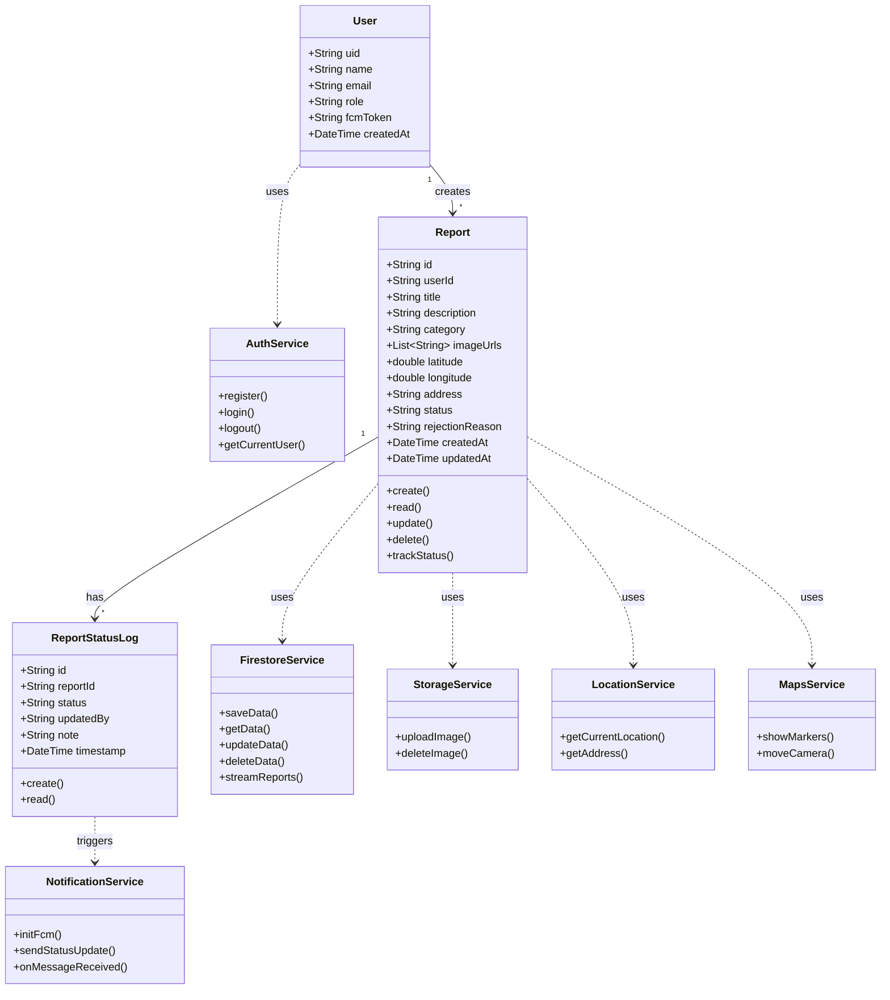
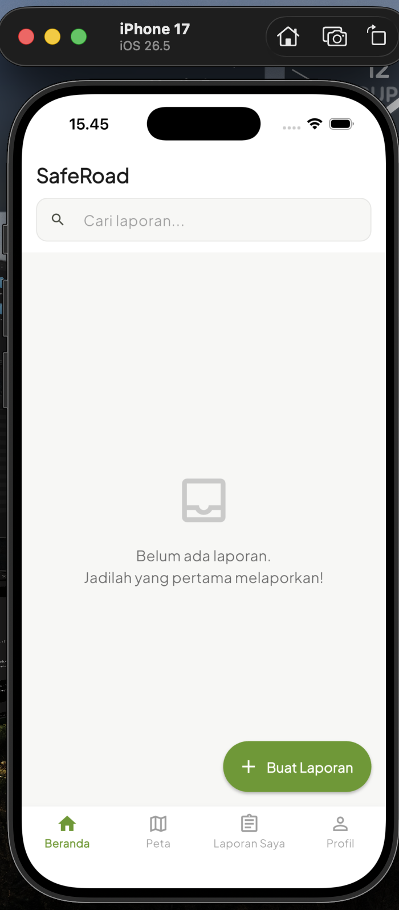
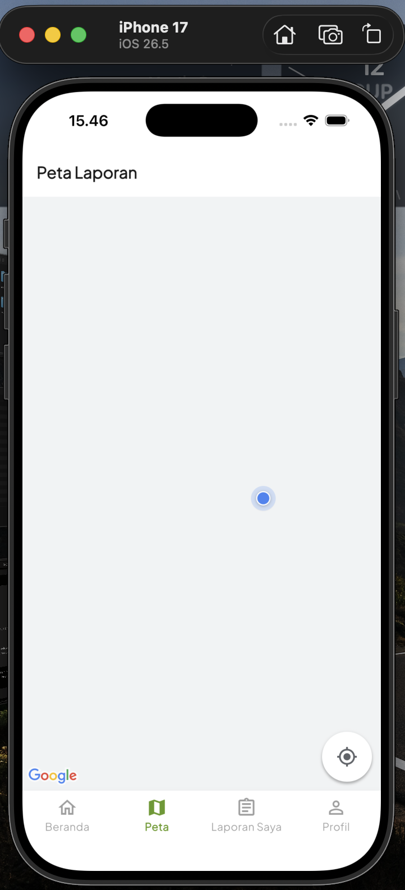
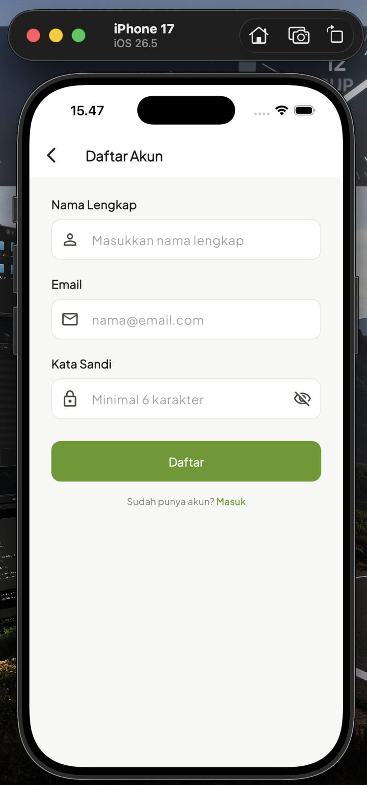
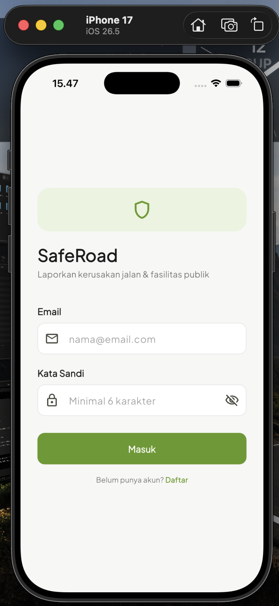
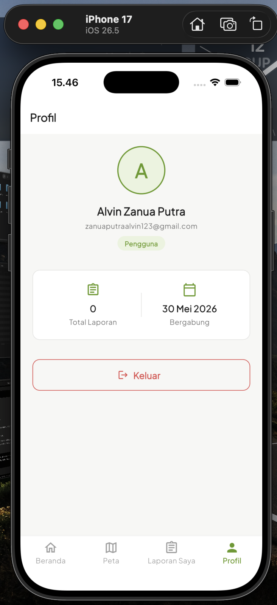

# SafeRoad - Aplikasi Pelaporan Jalan

## Anggota Kelompok

| NRP | Nama | Kelas | Role |
| :--- | :--- | :--- | :--- |
| 5025231023 | Nabil Julian Syah | Mobile Programming (E) | Admin Features |
| 5025231064 | Alvin Zanua Putra | Mobile Programming (E) | User Features |
| 5025231126 | Muhammad Khibban I'tishom | Mobile Programming (E) | Additional Features |

## Deskripsi Aplikasi

SafeRoad adalah aplikasi mobile berbasis Flutter yang memungkinkan warga melaporkan kerusakan jalan dan fasilitas publik, seperti jalan berlubang, lampu jalan mati, rambu lalu lintas rusak, dan marka jalan yang pudar. Warga cukup mengambil foto kerusakan, menuliskan deskripsi, dan mengirim laporan beserta titik lokasi yang dideteksi otomatis melalui GPS perangkat.

Seluruh laporan tersimpan di Firebase Firestore dan tersinkronisasi secara realtime. Dari sisi pemerintah atau pengelola, administrator dapat memantau laporan yang masuk, memvalidasi keabsahannya, lalu memperbarui status perbaikan. Setiap kali status sebuah laporan berubah, pelapor akan menerima notifikasi push sehingga dapat mengikuti perkembangan perbaikan tanpa perlu mengecek aplikasi secara manual.

## Poin SDGs

1. **SDG 9 (Industry, Innovation and Infrastructure)** 
2. **SDG 11 (Sustainable Cities and Communities)** 

    Kedua SDGs tersebut mendukung aplikasi ini dengan mendorong partisipasi warga dalam pemeliharaan infrastruktur publik dan membantu pengelola kota membuat keputusan perbaikan berdasarkan data laporan yang nyata.

## Class Diagram



Diagram di atas memisahkan **entitas data** (`User`, `Report`, `ReportStatusLog`) dari **service** yang menangani logika operasi. `User` membuat banyak `Report`, dan setiap `Report` memiliki banyak `ReportStatusLog` yang mencatat riwayat perubahan status. Lalu ketika status laporan diperbarui dan log baru dibuat, `NotificationService` terpicu untuk mengirim notifikasi ke pelapor.

## Fitur

### User Features (Alvin Zanua Putra)

Fitur yang dapat digunakan warga sebagai pelapor:

- **Registrasi dan Login:** Membuat akun baru dan masuk menggunakan email dan kata sandi melalui Firebase Authentication.
- **Membuat Laporan Kerusakan:**  Menulis judul, deskripsi, dan memilih kategori kerusakan (jalan berlubang, lampu jalan, rambu, marka, atau lainnya).
- **Mengunggah Foto:** Melampirkan satu atau lebih foto kerusakan yang disimpan di Firebase Storage.
- **Deteksi Lokasi Otomatis:** Titik koordinat dan alamat lokasi kerusakan diambil otomatis dari GPS perangkat.
- **Melihat Laporan di Peta:** Seluruh laporan ditampilkan sebagai penanda (marker) di Google Maps.
- **Mengelola Laporan (CRUD):** Mengubah atau menghapus laporan yang dibuat sendiri selama belum diproses admin.
- **Melacak Status Laporan:**  Memantau perkembangan laporan dari status menunggu hingga selesai diperbaiki.
- **Notifikasi Push:** Menerima pemberitahuan setiap kali status laporan miliknya berubah.

### Admin Features (Nabil Julian Syah)

Fitur untuk administrator atau pengelola yang memvalidasi dan menindaklanjuti laporan:

- **Melihat Seluruh Laporan:** Menampilkan semua laporan dari seluruh pengguna dalam satu daftar.
- **Memvalidasi Laporan:** Menandai laporan sebagai sah (verified) atau menolaknya (rejected) beserta alasan penolakan.
- **Memperbarui Status Perbaikan:** Mengubah status laporan menjadi sedang diperbaiki (in progress) atau selesai (completed).
- **Mengelola dan Menghapus Laporan:** Menghapus laporan yang tidak valid atau duplikat dari basis data.

### Additional Features (Muhammad Khibban I'tishom)

Fitur pendukung yang meningkatkan pengalaman dan nilai analitik aplikasi:

- **Pencarian Laporan Berdasarkan Kategori:** Menyaring laporan menurut jenis kerusakan untuk mempermudah penelusuran.
- **Sinkronisasi Realtime:** Daftar dan status laporan diperbarui secara langsung di semua perangkat tanpa perlu memuat ulang.
- **Statistik Dashboard:** Menampilkan ringkasan jumlah laporan per kategori dan per status untuk membantu pengelola memantau kondisi infrastruktur.

## Alur Status Laporan

Setiap laporan melewati alur status berikut, yang dikelola oleh administrator dan dipantau oleh pelapor:

| Status | Keterangan |
| :--- | :--- |
| `menunggu` | Laporan baru dikirim warga, menunggu pemeriksaan admin. |
| `disetujui` | Laporan telah diperiksa dan dinyatakan sah oleh admin. |
| `dalamPengerjaan` | Perbaikan terhadap kerusakan sedang berlangsung. |
| `selesai` | Kerusakan telah selesai diperbaiki. |
| `ditolak` | Laporan ditolak karena tidak valid, duplikat, atau tidak relevan. |

## Teknologi yang Digunakan

| Bagian | Teknologi |
| :--- | :--- |
| Frontend | Flutter |
| Autentikasi | Firebase Authentication |
| Basis Data | Firebase Firestore |
| Penyimpanan Berkas | Firebase Storage |
| Notifikasi | Firebase Cloud Messaging (FCM) |
| Peta dan Lokasi | Google Maps API, Geolocation API |

## Struktur Basis Data (Firestore)

```
users/{uid}
    - uid, name, email, role, fcmToken, createdAt

reports/{reportId}
    - id, userId, title, description, category
    - imageUrls, latitude, longitude, address
    - status, rejectionReason, createdAt, updatedAt

reports/{reportId}/statusLogs/{logId}
    - id, reportId, status, updatedBy, note, timestamp
```

## Cara Menjalankan

1. Pastikan Flutter SDK sudah terpasang di perangkat.
2. Clone repositori ini:
   ```bash
   git clone https://github.com/Bibiing/SafeRoad.git
   cd SafeRoad
   ```
3. Install seluruh dependensi:
   ```bash
   flutter pub get
   ```
4. Tambahkan berkas konfigurasi Firebase (`google-services.json` untuk Android dan `GoogleService-Info.plist` untuk iOS) ke direktori yang sesuai.
5. Masukkan kunci Google Maps API pada `android/app/src/main/AndroidManifest.xml`.
6. Jalankan aplikasi:
   ```bash
   flutter run
   ```

## Preview Aplikasi

### 1. Halaman Fitur User

<p align="center">
   
   
   
   
   
</p>

### 2. Halaman Fitur Admin

<p align="center">

</p>

### 3. Halaman Fitur Tambahan

<p align="center">

</p>

### Referensi

- Firebase Documentation
- Google Maps Platform Documentation
- Flutter Documentation

