# SafeRoad - Aplikasi Pelaporan Jalan

## Anggota Kelompok

| NRP        | Nama                      | Kelas                  | Role                |
| :--------- | :------------------------ | :--------------------- | :------------------ |
| 5025231023 | Nabil Julian Syah         | Mobile Programming (E) | Admin Features      |
| 5025231064 | Alvin Zanua Putra         | Mobile Programming (E) | User Features       |
| 5025231126 | Muhammad Khibban I'tishom | Mobile Programming (E) | Additional Features |

## Deskripsi Aplikasi

SafeRoad adalah aplikasi mobile berbasis Flutter yang memungkinkan warga melaporkan kerusakan jalan dan fasilitas publik, seperti jalan berlubang, lampu jalan mati, rambu lalu lintas rusak, dan marka jalan yang pudar. Warga cukup memilih kategori, mengambil foto kerusakan, menuliskan deskripsi, dan mengirim laporan beserta titik lokasi yang dideteksi otomatis melalui GPS perangkat.

Pengguna dapat masuk menggunakan email dan kata sandi atau melalui akun Google (Google Sign-In). Seluruh laporan tersimpan di Cloud Firestore dan foto diunggah ke ImageKit. Dari sisi pengelola, administrator memantau laporan yang masuk, memvalidasi keabsahannya, lalu memperbarui status perbaikan. Setiap kali status sebuah laporan berubah, pelapor menerima notifikasi push (FCM) dan notifikasi dalam aplikasi, serta dapat melihat perubahan status secara realtime pada halaman detail. Aktivitas warga juga dihargai dengan sistem poin kontribusi, level, dan achievement.

## Poin SDGs

1. **SDG 9 (Industry, Innovation and Infrastructure)**
2. **SDG 11 (Sustainable Cities and Communities)**

   Kedua SDGs tersebut mendukung aplikasi ini dengan mendorong partisipasi warga dalam pemeliharaan infrastruktur publik dan membantu pengelola kota membuat keputusan perbaikan berdasarkan data laporan yang nyata.

## Arsitektur

Aplikasi mengikuti pola **MVVM 3-layer** dengan pemisahan tegas:

- **Presentation (`lib/ui/`)** — View (widget) dan ViewModel (`ChangeNotifier`) dengan state via Provider. View dan ViewModel tidak mengakses Firebase/Firestore secara langsung.
- **Domain (`lib/domain/`)** — Model murni Dart (`AppUser`, `Report`, dll), enum, dan kontrak repository (interface).
- **Data (`lib/data/`)** — Implementasi repository, data source (Firebase Auth, Firestore, FCM, ImageKit, lokasi), dan DTO untuk translasi ke/dari Firestore.

## Class Diagram

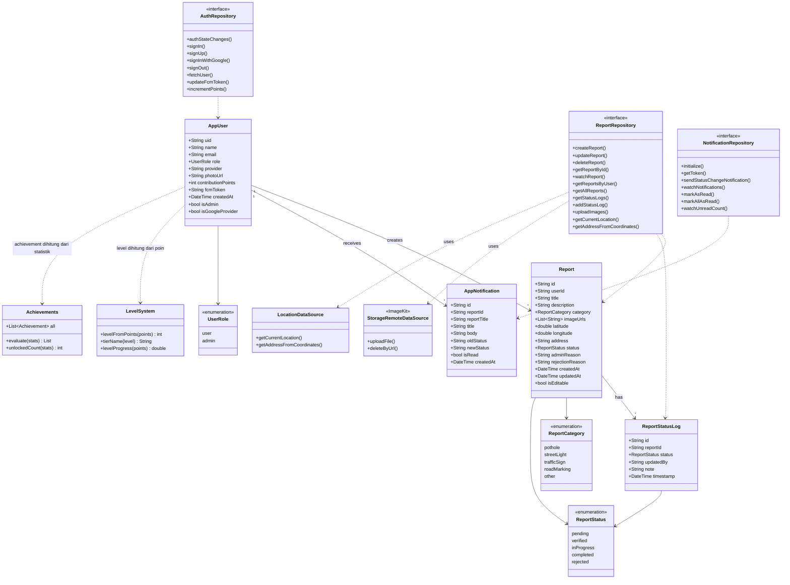

### Penjelasan Diagram

**Notasi.** Tanda `+` menandai anggota publik. `<<interface>>` adalah kontrak abstrak yang diimplementasikan kelas `...Impl` di layer data. `<<enumeration>>` adalah enum. Angka `1` dan `*` pada relasi menunjukkan kardinalitas (satu ke banyak). Panah garis penuh `-->` adalah asosiasi (kepemilikan data antar entitas), sedangkan panah putus-putus `..>` adalah ketergantungan (satu kelas memakai kelas lain).

**Model domain (data inti).**

- `AppUser` — profil pengguna: identitas (`uid`, `name`, `email`), `role`, metode masuk (`provider`, `photoUrl`), `contributionPoints`, dan `fcmToken`. `isAdmin` dan `isGoogleProvider` adalah getter turunan.
- `Report` — laporan kerusakan: pembuat (`userId`), `category`, `status`, daftar `imageUrls`, koordinat dan `address`, serta `adminReason` (catatan admin; `rejectionReason` adalah field lama/deprecated). Getter `isEditable` bernilai true hanya saat status masih `pending`.
- `ReportStatusLog` — satu entri riwayat perubahan status sebuah laporan (status baru, siapa yang mengubah, catatan, waktu). Disimpan sebagai sub-collection di bawah laporan.
- `AppNotification` — notifikasi perubahan status yang diterima pelapor (judul, isi, status lama menuju status baru, dan penanda sudah/belum dibaca).

**Enumerasi.** `UserRole` (user/admin) menentukan hak akses, `ReportCategory` menentukan jenis kerusakan, dan `ReportStatus` menandai tahap penanganan (pending menuju verified, inProgress, lalu completed, atau rejected). Label Bahasa Indonesia dan konversi ke/dari Firestore disediakan di tiap enum.

**Kontrak repository (layer domain).** ViewModel hanya bergantung pada interface ini, bukan pada Firebase secara langsung:

- `AuthRepository` — login/registrasi email, Google Sign-In, ambil profil user, perbarui FCM token, dan tambah poin kontribusi.
- `ReportRepository` — CRUD laporan, pantau detail secara realtime (`watchReport`), daftar laporan (semua atau per user), status log, upload foto, serta lokasi dan alamat.
- `NotificationRepository` — inisialisasi FCM, manajemen token, dan CRUD notifikasi di Firestore.

**Data source dan utilitas (layer data/core).**

- `StorageRemoteDataSource` (implementasi ImageKit) menangani upload dan hapus foto; `ReportRepository` bergantung padanya.
- `LocationDataSource` menyediakan lokasi GPS dan reverse geocoding, juga dipakai oleh `ReportRepository`.
- `LevelSystem` dan `Achievements` adalah utilitas murni yang menghitung level/tier dan achievement dari `contributionPoints` serta statistik laporan milik `AppUser` (tidak disimpan terpisah di basis data).

**Relasi utama.**

- Satu `AppUser` membuat banyak `Report` (`1` ke `*`).
- Satu `Report` memiliki banyak `ReportStatusLog` (`1` ke `*`).
- Satu `AppUser` menerima banyak `AppNotification` (`1` ke `*`).
- `AppUser`, `Report`, dan `ReportStatusLog` mereferensikan enum terkait (`UserRole`, `ReportCategory`, `ReportStatus`).
- Tiap repository bergantung (panah putus-putus) pada model yang dikelolanya; `ReportRepository` juga memakai `StorageRemoteDataSource` dan `LocationDataSource`, dan `AppUser` bergantung pada `LevelSystem` serta `Achievements` untuk perhitungan kontribusi.

## Fitur

### User Features (Alvin Zanua Putra)

Fitur yang dapat digunakan warga sebagai pelapor:

- **Registrasi dan Login:** Membuat akun dan masuk dengan email dan kata sandi, atau masuk cepat dengan akun Google (Google Sign-In), melalui Firebase Authentication.
- **Membuat Laporan Kerusakan:** Memilih kategori (jalan berlubang, lampu jalan, rambu, marka, atau lainnya) dan menuliskan deskripsi; judul laporan dibentuk otomatis dari kategori dan alamat.
- **Mengunggah Foto:** Melampirkan hingga 5 foto kerusakan per laporan (dipilih satu per satu, bisa dihapus sebelum dikirim) yang disimpan di ImageKit.
- **Deteksi Lokasi Otomatis:** Koordinat dan alamat lokasi diambil otomatis dari GPS perangkat (geolocator + geocoding), dengan pratinjau peta kecil di form.
- **Melihat Laporan di Peta:** Seluruh laporan tampil sebagai marker berwarna sesuai status di Google Maps, lengkap dengan pencarian, filter kategori, dan kartu pratinjau berjarak.
- **Mengelola Laporan (CRUD):** Mengubah atau menghapus laporan milik sendiri selama masih berstatus menunggu.
- **Melacak Status Laporan:** Memantau perkembangan laporan dari menunggu hingga selesai, termasuk timeline riwayat status.
- **Galeri Foto Laporan:** Melihat foto pada halaman detail sebagai slideshow yang bisa digeser (dengan indikator dan dot), lalu membukanya layar penuh dengan zoom (pinch-to-zoom) dan swipe antar foto.
- **Notifikasi:** Menerima notifikasi push (FCM) dan notifikasi dalam aplikasi setiap kali status laporan miliknya berubah, dengan badge jumlah belum dibaca. Notifikasi tampil di notification center perangkat (system tray) termasuk saat aplikasi di background/tertutup, dan mengetuknya membuka halaman notifikasi di dalam aplikasi.
- **Profil dan Kontribusi:** Melihat profil berisi jumlah laporan dikirim, laporan selesai, dan poin kontribusi, lengkap dengan level, tier, dan achievement. Bila masuk via Google, foto profil akun Google ditampilkan (dengan fallback ke avatar inisial).

### Admin Features (Nabil Julian Syah)

Fitur untuk administrator atau pengelola yang memvalidasi dan menindaklanjuti laporan:

- **Dasbor Admin:** Ringkasan jumlah laporan (Total, Menunggu, Diproses, Selesai) dengan akses cepat ke pengelolaan laporan dan statistik.
- **Melihat Seluruh Laporan:** Menampilkan semua laporan dari seluruh pengguna dalam satu daftar dengan pencarian dan filter status.
- **Memvalidasi dan Memperbarui Status:** Mengubah status laporan (verified, inProgress, completed, rejected) melalui lembar pilihan (bottom sheet) berlabel status; alasan wajib diisi saat menolak. Perubahan beserta catatan/alasan admin dicatat ke riwayat status dan memicu notifikasi ke pelapor.
- **Ekspor Data:** Mengekspor daftar laporan ke berkas CSV untuk dibagikan.

### Additional Features (Muhammad Khibban I'tishom)

Fitur pendukung yang meningkatkan pengalaman dan nilai analitik aplikasi:

- **Pencarian dan Filter Kategori:** Menyaring laporan menurut judul/alamat dan jenis kerusakan.
- **Sinkronisasi Realtime (halaman detail):** Status laporan pada halaman detail diperbarui langsung saat admin mengubahnya, tanpa refresh manual. Daftar (beranda/peta/laporan saya/kelola) memakai pull-to-refresh.
- **Statistik Laporan:** Ringkasan jumlah laporan per status dan per kategori dalam bentuk bar proporsional.
- **Sistem Poin, Level, dan Achievement:** Poin kontribusi diberikan atas aktivitas pelapor, dengan level dan achievement yang terbuka otomatis.
- **Deteksi Offline:** Peringatan otomatis saat perangkat kehilangan koneksi internet, dengan opsi **Lanjutkan** (tetap memakai data yang sudah tampil) atau **Keluar**. Dialog tertutup otomatis dan muncul notifikasi singkat saat koneksi kembali tersedia.

### Beranda vs Laporan Saya

- **Beranda** menampilkan **semua** laporan dari seluruh pengguna (`getAllReports`).
- **Laporan Saya** menampilkan **hanya** laporan milik pengguna yang sedang login (`getReportsByUser`).

### Sistem Poin, Level, dan Achievement

Poin kontribusi diberikan otomatis atas aktivitas pelapor dan diakumulasi ke field `contributionPoints` (atomik via `FieldValue.increment`). Level, tier, dan achievement **dihitung** dari poin/statistik (lihat `core/utils/level_system.dart` dan `core/utils/achievements.dart`), tidak disimpan terpisah. Rincian perhitungan ini juga ditampilkan langsung di tab Profil.

**Cara mendapatkan poin**

| Aksi                                 | Poin | Diberikan kepada |
| :----------------------------------- | :--- | :--------------- |
| Membuat laporan baru                 | +10  | Pembuat laporan  |
| Laporan diverifikasi admin           | +5   | Pemilik laporan  |
| Laporan selesai (status `completed`) | +25  | Pemilik laporan  |

Poin dari admin hanya ditambahkan saat status benar-benar berubah, dan bersifat best-effort (kegagalan menambah poin tidak menggagalkan pembaruan status laporan).

**Level dan tier**

Setiap **100 poin** menaikkan 1 level, dengan level minimum 1. Rumusnya: `level = (poin / 100) + 1` (pembagian bulat).

| Tier         | Level | Rentang poin |
| :----------- | :---- | :----------- |
| Pemula       | 1-2   | 0-199        |
| Kontributor  | 3-4   | 200-399      |
| Pro Reporter | 5+    | 400+         |

Contoh: 0 poin = Level 1, 100 poin = Level 2, 250 poin = Level 3, 400 poin = Level 5.

**Achievement**

Achievement terbuka otomatis ketika syaratnya terpenuhi:

| Achievement     | Syarat                   |
| :-------------- | :----------------------- |
| Laporan Pertama | Kirim 1 laporan          |
| Pelapor Aktif   | Kirim 10 laporan         |
| Penyelesai      | 5 laporan selesai        |
| Centurion       | Kumpulkan 100 poin       |
| Pro Reporter    | Capai Level 5 (400 poin) |
| Pahlawan Jalan  | Kumpulkan 500 poin       |

## Alur Status Laporan

Setiap laporan melewati alur status berikut, yang dikelola oleh administrator dan dipantau oleh pelapor. Nilai enum dan label diambil dari `domain/model/enums.dart`.

| Nilai (enum) | Label        | Keterangan                                                        |
| :----------- | :----------- | :---------------------------------------------------------------- |
| `pending`    | Menunggu     | Laporan baru dikirim warga, menunggu pemeriksaan admin.           |
| `verified`   | Diverifikasi | Laporan telah diperiksa dan dinyatakan sah oleh admin.            |
| `inProgress` | Diproses     | Perbaikan terhadap kerusakan sedang berlangsung.                  |
| `completed`  | Selesai      | Kerusakan telah selesai diperbaiki.                               |
| `rejected`   | Ditolak      | Laporan ditolak karena tidak valid, duplikat, atau tidak relevan. |

## Teknologi Stak yang Digunakan

| Kategori                 | Teknologi                                       |
| :----------------------- | :---------------------------------------------- |
| Framework                | Flutter                                         |
| State management         | provider                                        |
| Autentikasi              | firebase_auth, google_sign_in                   |
| Basis data               | cloud_firestore                                 |
| Penyimpanan foto         | ImageKit (via dio)                              |
| Notifikasi               | firebase_messaging, flutter_local_notifications |
| Peta                     | google_maps_flutter                             |
| Lokasi dan alamat        | geolocator, geocoding                           |
| Kamera dan galeri        | image_picker                                    |
| Tipografi                | google_fonts (Plus Jakarta Sans)                |
| Animasi                  | flutter_animate                                 |
| Format tanggal dan angka | intl                                            |
| Ekspor dan berbagi       | csv, path_provider, share_plus                  |
| Inti Firebase            | firebase_core                                   |

## Struktur Folder (`lib/`)

```
lib/
├── main.dart                 # Entry point: init Firebase + dependency injection (Provider)
├── app.dart                  # MaterialApp, tema, AuthGate (routing berbasis peran)
├── firebase_options.dart     # Konfigurasi Firebase
├── core/
│   ├── constants/            # app_constants, firestore_collections
│   ├── state/                # view_status (enum status ViewModel)
│   ├── theme/                # app_colors, app_text_styles, app_theme
│   ├── utils/                # level_system, achievements, status_helper,
│   │                         #   category_helper, date_formatter, error_mapper, dll
│   └── widgets/              # komponen bersama (PrimaryButton, StatusPill,
│                             #   GoogleSignInButton, AppCard, EmptyState, dll)
├── domain/
│   ├── model/                # AppUser, Report, ReportStatusLog, AppNotification, enums
│   └── repository/           # kontrak AuthRepository, ReportRepository, NotificationRepository
├── data/
│   ├── local/                # session_local_datasource
│   ├── remote/               # data source Firebase, ImageKit, lokasi, FCM
│   │   └── dto/              # UserDto, ReportDto, ReportStatusLogDto, NotificationDto
│   └── repository/           # implementasi repository
└── ui/
    ├── splash/               # animated_splash_screen
    ├── auth/                 # login, register
    ├── user/                 # home, map, my_reports, create_report, edit_report,
    │                         #   report_detail, profile
    ├── admin/                # dashboard, all_reports
    └── additional/           # statistics, search, notifications, realtime_sync
```

## Struktur Basis Data (Firestore)

```
users/{uid}
    - uid, name, email, role, provider, photoUrl, contributionPoints
    - fcmToken, createdAt
    - (level, tier, dan achievement dihitung dari contributionPoints + data laporan)

reports/{reportId}
    - id, userId, title, description, category
    - imageUrls, latitude, longitude, address
    - status, adminReason, createdAt, updatedAt
    - (rejectionReason: field lama/deprecated, hanya dibaca untuk kompatibilitas)

reports/{reportId}/statusLogs/{logId}
    - id, reportId, status, updatedBy, note, timestamp

notifications/{userId}/items/{notificationId}
    - id, reportId, reportTitle, title, body
    - oldStatus, newStatus, isRead, createdAt
```

## Preview Aplikasi

### 1. Halaman Fitur User

<p align="center">
   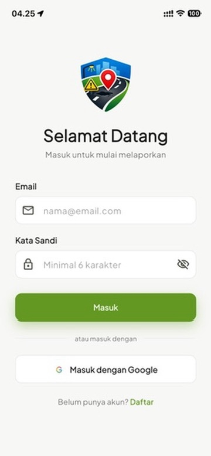
   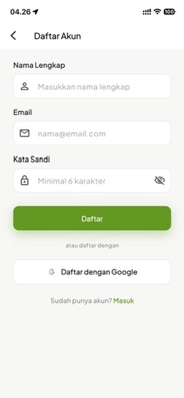
   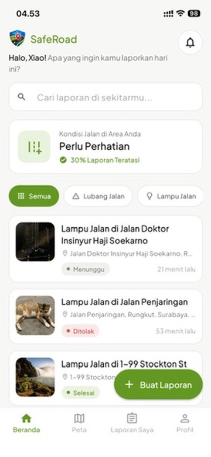
   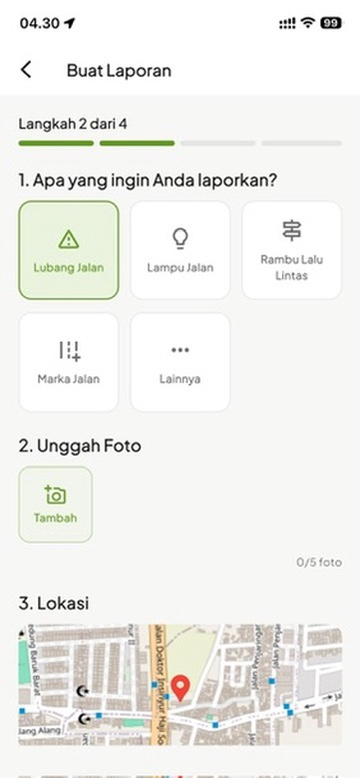
   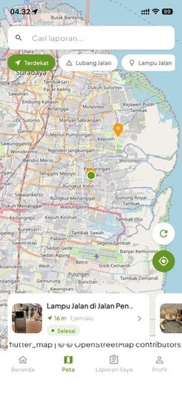
</p>
<p align="center">
   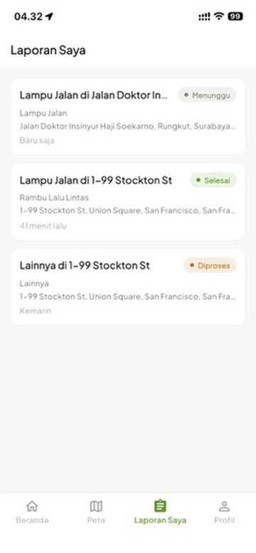
   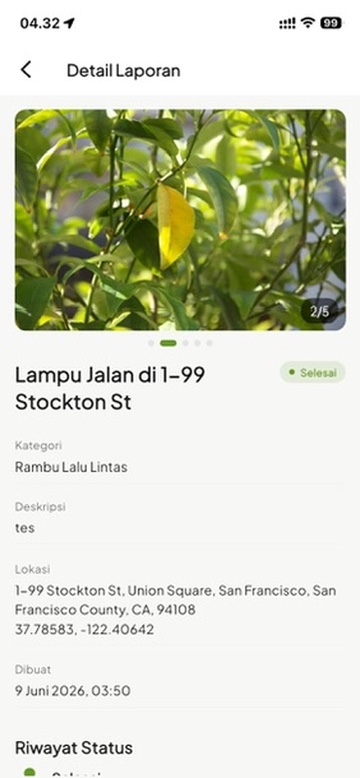
   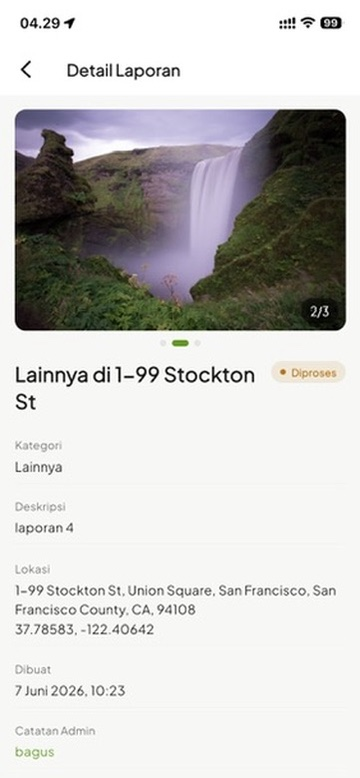
   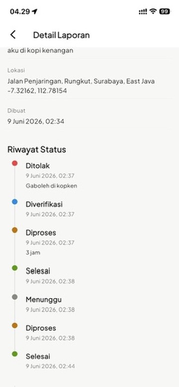
</p>

### 2. Halaman Fitur Admin

<p align="center">
   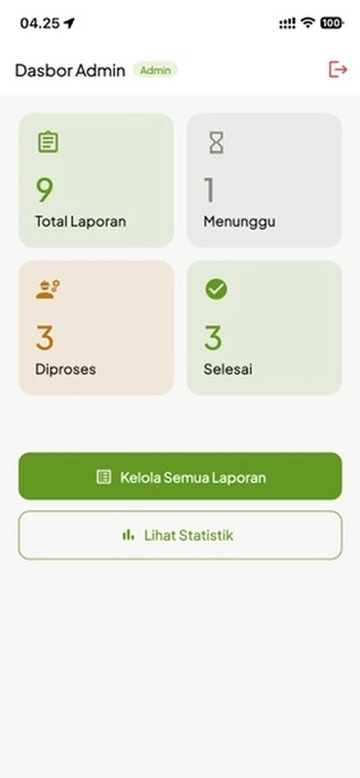
   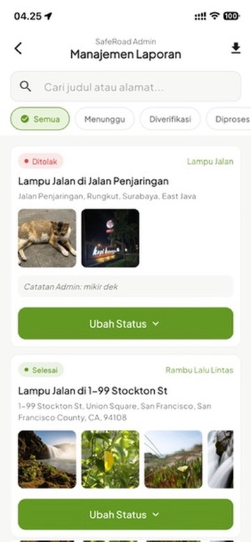
   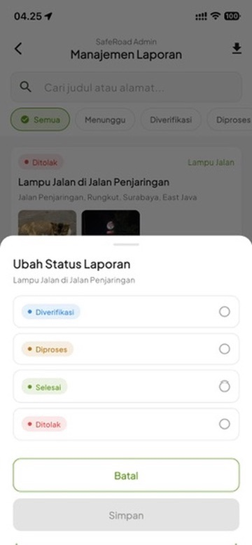
   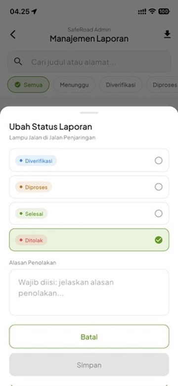
</p>

### 3. Halaman Fitur Tambahan

<p align="center">
   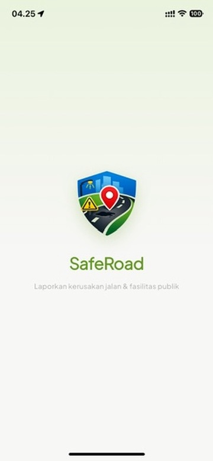
   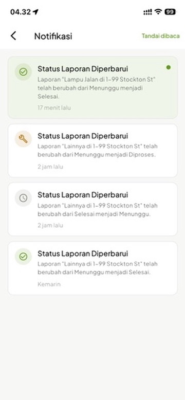
   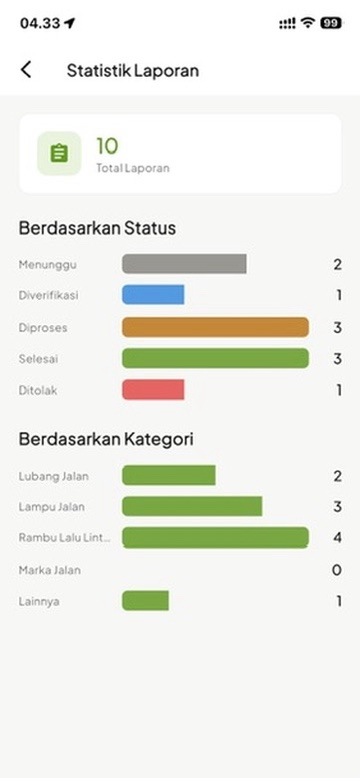
   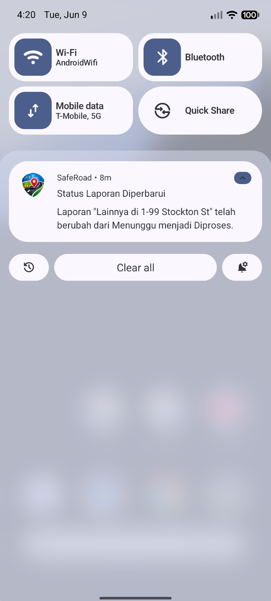
</p>
<p align="center">
   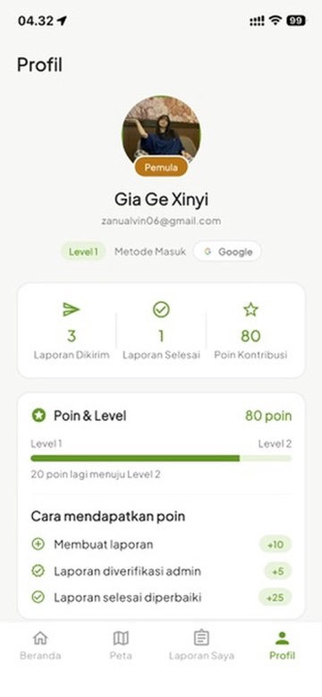
   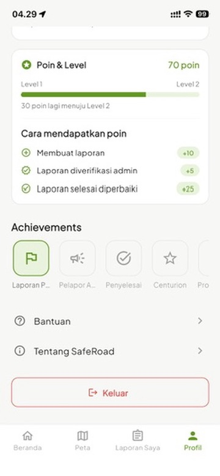
   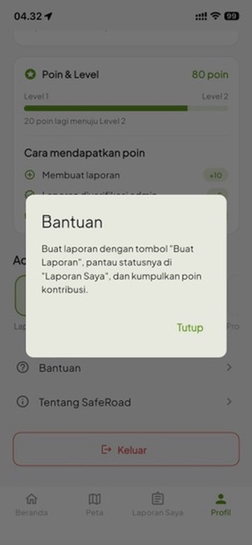
   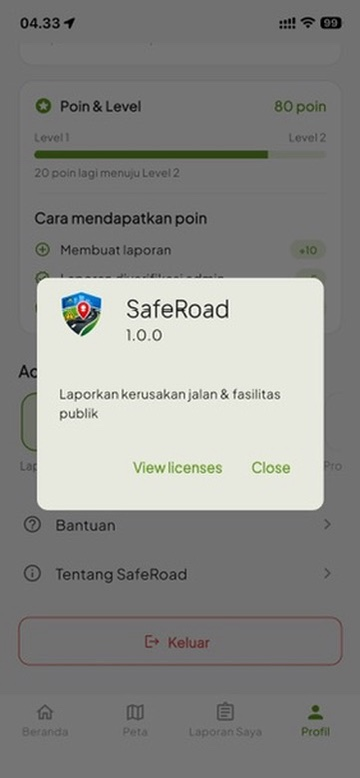
</p>

## Rencana Pengembangan

Sistem poin kontribusi saat ini berfungsi sebagai gamifikasi untuk mendorong partisipasi warga. Bila aplikasi dikembangkan lebih lanjut, poin ini berpotensi memiliki nilai tukar nyata, misalnya:

- **Integrasi dengan mitra layanan** seperti Grab atau penyedia transportasi dan ritel lain, sehingga poin dapat dikonversi menjadi saldo, kredit perjalanan, atau benefit mitra.
- **Penukaran poin (redeem)** menjadi diskon, voucher, atau hadiah dari pemerintah daerah maupun sponsor sebagai bentuk apresiasi atas kontribusi pelapor.
- **Katalog reward di dalam aplikasi** tempat pengguna menukar poin dengan berbagai penawaran yang tersedia.
- **Program insentif berjenjang** berdasarkan tier (Pemula, Kontributor, Pro Reporter), dengan benefit yang meningkat seiring kenaikan level.

Untuk mewujudkannya, diperlukan pengembangan tambahan seperti riwayat transaksi poin, mekanisme verifikasi laporan dan anti-kecurangan yang lebih ketat, serta kerja sama resmi dengan mitra dan pemangku kepentingan terkait.
